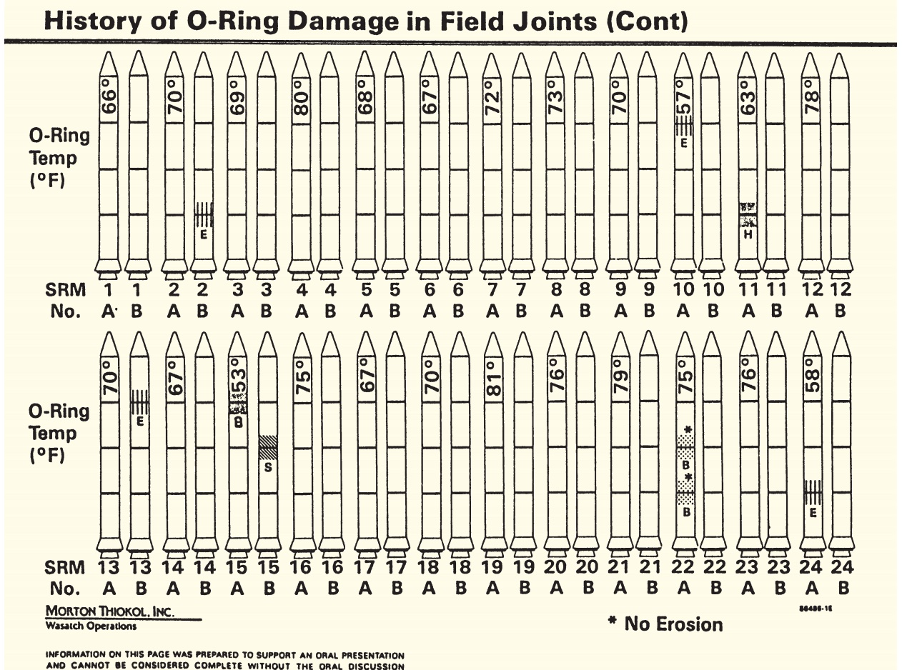

\newpage

## Motivation

This document seeks to peel back the layers of successful information
presentation, and define critical features of effective data
visualizations. By comparing an example of successful data communication
with an example of failed data communication, a set of data
visualization best practices can be defined.

## Dr. John Snow and the Cholera Epidemic

### Background

-   In 1854, there was a sudden outbreak of cholera in central London
    near Broad Street (\~500 people died in 10 days)

-   Dr. John Snow suspected a water pump on Broad Street was the cause

-   Initial tests of the water revealed nothing suspicious

-   John Snow noticed that on the list of 83 deaths he obtained, *only 6
    of them did not drink the Broad Street pump water*

-   By constructing effective visual representations of the data he
    collected, Dr. Snow was able to effectively accomplish the task of
    discovering the mechanism of cholera infection, and proved that
    cholera is transmitted by water, not air

### Recipe for Effectiveness

-   John Snow had studied epidemics as part of his life work, and
    therefore had deep knowledge of epidemic patterns, which contributed
    to his correct hypothesis

-   However, being correct wasn't enough: his information delivery
    method had to effectively convey the evidence to the public, who
    generally maintained the opposite theory (that cholera was airborne)

#### *Appropriate* data context

-   **Inappropriate Context**: the data Snow obtained was ordered by
    death date as in the image below. Tufte states "the passage of time
    is a poor explanatory variables, practically useless in discovering
    a strategy of how to intervene and stop the epidemic"[^1]

    {width="816"}

-   **Appropriate Context**: Since Snow's hypothesis was that a spatial
    feature (the pump) was the cause of Cholera, he produced a spatial
    representation of the data instead of using the temporal report

-   The bars (\|\|\|\|) represent deaths from Cholera and the dots
    represent pump locations. Note: the Broad Street pump is adjacent to
    the "d" in the word "Broad"

    

    {width="720"}

    

[^1]: Pg. 7

#### Using *qualitative comparisons*

-   A critical feature of extracting patterns from data requires
    comparison or control

    

    

    

-   Dr. John Snow's famous map visualization utilizes the color channel
    to highlight two "control" cases as shown in Figure 3.

    1.  The Brewery

        -   After discussion with the owner of the Brewery, Mr. Higgins,
            Dr. Snow learned "Mr. Higgins believes [the employees] do
            not drink water at all" since they are allowed the drink the
            malt liquor.[^2]

    2.  The Work House

        -   The Workhouse on Poland Street had its own well inside the
            building, so the inmates never ventured to the Broad Street
            pump to get water

[^2]: Pg 9

#### Careful Consideration of Alternatives: An Exercise in Humility pt. 1

-   When evaluating cholera deaths that occurred farther from the Broad
    Street pump (outliers), John Snow discovered that they actually did
    relate to the Broad Street pump (attended school nearby, favored the
    water flavor from the Broad Street pump, etc.)

-   The least convincing aspect of Snow's work is the most celebrated -
    when the Broad Street pump handle was removed. This moment has been
    interpreted to be the turning point for the Cholera epidemic,
    although the evidence is weak as seen in figure 4 below.

    {width="422"}

#### Possibility of Error: An Exercise in Humility pt. 2

-   **Data Integrity**: John Snow's analysis of the spatial distribution
    of cholera cases was accompanied by an analysis of data quality in
    order to reassure readers that the story presented in his
    visualizations were accurate an unperturbed by the possibility of
    bias

-   **Representational Integrity**: John Snow's map suffered from one
    particularly dangerous shortcoming - it did not account for
    population density. In the case where the population of central
    London was distributed the same way cholera deaths were, the "map
    would have merely repeated the unimportant fact that more people
    lived near the Broad Street pump than elsewhere."[^3]

    -   The population of central London was distributed more or less
        uniformly so this concern did not manifest, and John Snow did
        address this in textual analysis, but the possibility of
        misrepresenting rates on the map visual was a shortcoming

-   **Misleading Aggregations**: As an aside, if the time-series plot of
    cholera deaths over time were aggregated to the weekly granularity
    (Figure 5) instead of daily granularity (Figure 4), the intervention
    of removing the Broad Street pump handle appears to be *the*
    critical moment in the 1854 London cholera story.

    {width="423"}

[^3]: Pg 13

### Concluding Remarks

-   Visualization effectiveness requires the data be represented:

    1.  In the appropriate context as defined by the task abstraction,

    2.  Using quantitative comparisons to underscore the possible
        mechanisms of action

    3.  With a robust consideration of alternative explanations, and

    4.  With a discussion of potential data integrity issues and
        humility

\newpage

## The Decision to Launch the Space Shuttle Challenger

### Background

-   In 1986, the space shuttle Challenger exploded 73 seconds after the
    rockets were ignited because the weather was too cold for the o-ring
    mechanisms to maintain enough resiliency to prevent fuel leakage

-   The night before the launch, the engineers of the Challenger
    unsuccessfully presented a series of 13 highly ineffective
    visualizations aimed at preventing the scheduled launch

-   By creating visual analyses that disregarded the task at hand
    (namely, showing the effect cold temperatures have on the structural
    integrity of o-ring mechanisms), the engineers failed to effectively
    convey critical information to the decision makers at NASA

### Recipe for Failure

#### Nonexistent Ownership:

-   The title chart provided by the Thiokol engineers did not list any
    of the engineers names, potentially inducing a sense of doubt in the
    consumers of the information to come

#### Missing Critical Context in Task Definition:

-   Given the task of the engineers, they needed to demonstrate how
    temperature affected o-ring resiliency

-   Instead, they introduced their argument by simply reporting select
    prior launches that experience o-ring damage without introducing
    their concern that *temperature* caused o-ring problems as seen
    below in Figure 6

    

    {width="720"}

    

-   The following charts provided by the engineers continued to neglect
    describing the likely mechanism of action (temperature) in favor of
    technical jargon that was irrelevant to the intended task (see
    Figure 7 below, if it makes no sense, that's the point)

    

    {width="720"}

    

#### Ineffective Magnitude Channel Application

-   When temperature finally entered the visual analysis included in the
    charts, a highly ineffective/nonexistent magnitude channel was used
    as seen in Figure 8

    

    {width="720"}

    

-   The subsequent presidential investigation that continued to use
    visualizations that obscured the task with improper visual channel
    application (see Figure 9)

    

    {width="720"}

    

-   Figure 9 has other issues that make it difficult to decipher

    1.  **Missing legend**: the chart developers thought readers would
        memorize legend from prior visual)

    2.  **"Chartjunk"**[^4]: more focus was spent drawing mini rockets
        than effectively highlighting the affect temperature has on
        o-ring integrity

    3.  **Wrong order:** the rockets are ordered by launch date, not by
        temperature, therefore it becomes impossible to see the
        relationship between temperature and o-ring integrity

[^4]: Pg 26

#### Cherry-Picking Quantitative Comparisons

-   The engineers defined the scope to be *only* launches that
    experienced unrelated o-ring problems instead of using
    a**quantitative comparison** or control

-   As seen in Figure 8, the engineers defined the comparison scope to
    be just two prior launches that experienced o-ring problems, the
    relationship between temperature and o-ring damage is completely
    obscured

-   In addition to cherry-picking the comparisons, the engineers failed
    to consider alternative explanations for the cherry-picked data

-   In fact, those at NASA in favor of launching used Figure 8 to
    demonstrate that SRM-15 and SRM-22 both experienced o-ring damage
    and were at vastly different temperatures, therefore, they argued,
    temperature isn't related to o-ring damage

-   Figure 9 shows a more appropriate *ex ante* scope the engineers
    could and should have used. Red items show data the engineers
    provided in their charts

    

    {width="720"}

    

#### Possible Alternative Solutions:

-   Figure 11 below demonstrates a far more effective visualization that
    fixes the flaws mentioned above:

    1.  The context is immediately apparent by simply reading the axis
        titles

    2.  Temperature is the ordered x-axis attribute that utilized
        position on a common scale, the most effective channel for
        presenting magnitude data

    3.  *All* previous launches are shown, not just those that
        experience o-ring damage

        

        {width="720"}

        

-   This visualization immediately provides evidence that launching the
    challenger was a gigantic mistake; as Tufte states, "had the correct
    scatterplot or data table been constructed, no one would have dared
    to risk the Challenger in such cold weather."[^5]

[^5]: Pg 30

### Concluding Remarks

-   Visualization effectiveness will be degraded when the data is:

    1.  Not visualized in context as defined by the task abstraction,

    2.  Not appropriately represented with effective channels

    3.  Not quantitatively compared to an appropriate and complete
        universe of valid comparables

    4.  Not considered in the context of possible alternative
        explanations
